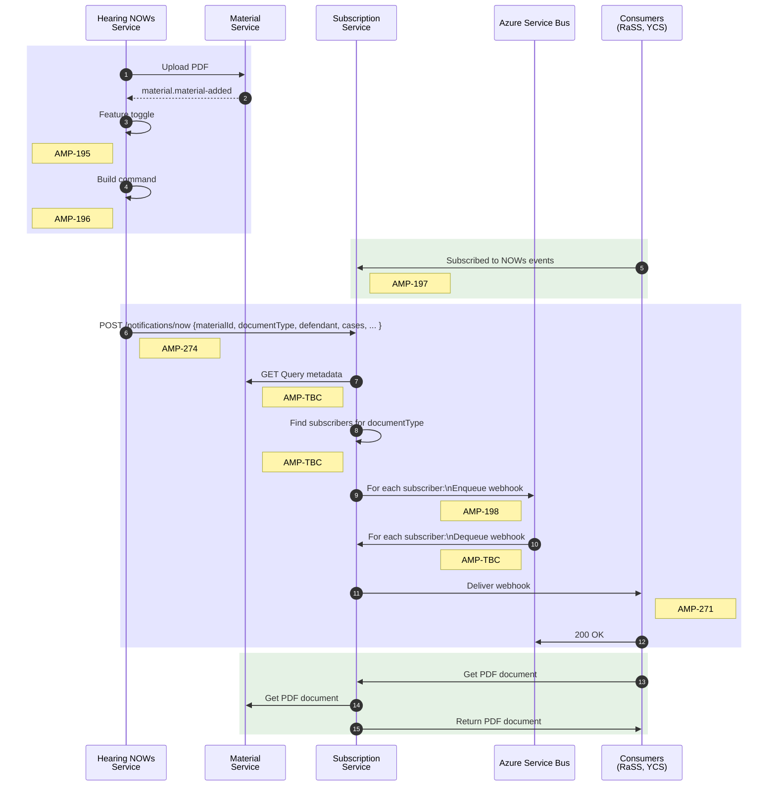

### Nows/Results subscription Sequence diagram

```mermaid
%%{init: {"theme": "light"} }%%

sequenceDiagram
    autonumber

    participant HN as Hearing NOWs<br/>Service
    participant MS as Material<br/>Service
    participant SS as Subscription<br/>Service
    participant Q as Azure Service Bus
    participant C as Consumers<br/>(RaSS, YCS)

%% Hearing NOWs — near-white blue
rect rgba(0, 0, 255, 0.1)
HN->>MS: Upload PDF


MS-->>HN: material.material-added

HN->>HN: Feature toggle
note left of HN: AMP-195

HN->>HN: Build command
note left of HN: AMP-196
end

%% Subscription setup — near-white green
rect rgba(0, 128, 0, 0.1)
C->>SS: Subscribed to NOWs events
note right of SS: AMP-197
end

%% Notification trigger
 rect rgba(0, 0, 255, 0.1)
HN->>SS: POST /notifications/now {materialId, documentType, defendant, cases, ... }
note right of HN: AMP-274

SS->>MS: GET Query metadata
note left of SS: AMP-TBC

%% Subscription processing

SS->>SS: Find subscribers for documentType
note left of SS: AMP-TBC

SS->>Q: For each subscriber:\nEnqueue webhook
note left of Q: AMP-198

Q->>SS: For each subscriber:\nDequeue webhook
note left of Q: AMP-TBC

%% Azure Service Bus — near-white yellow

SS->>C: Deliver webhook
note right of C: AMP-271

C->>Q: 200 OK
end
rect rgba(0, 128, 0, 0.1)
C->>SS: Get PDF document

SS->>MS: Get PDF document

SS->>C: Return PDF document
end


```