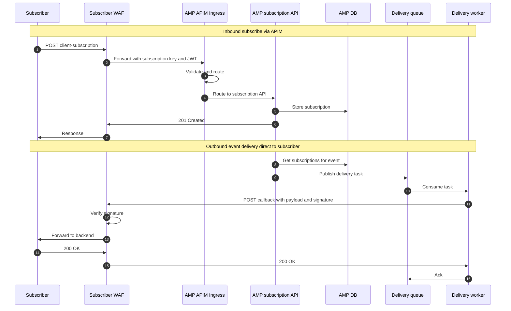
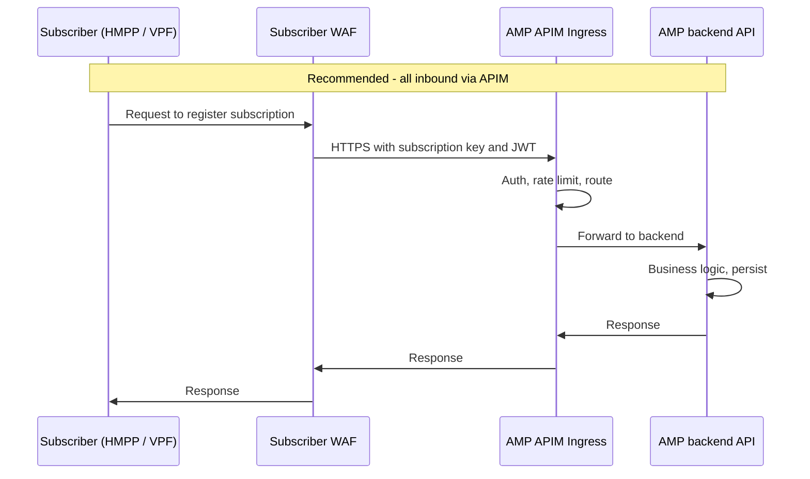
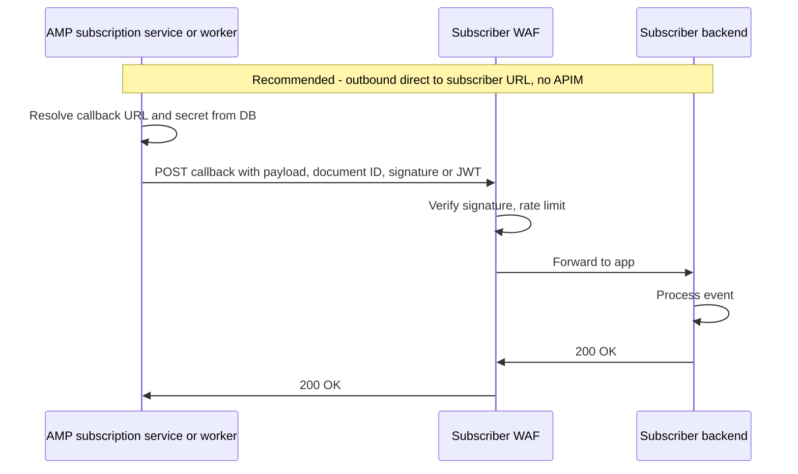
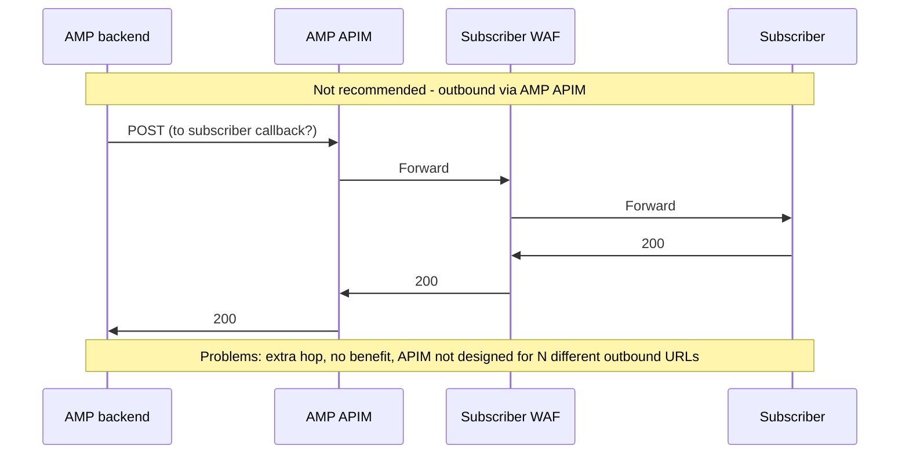
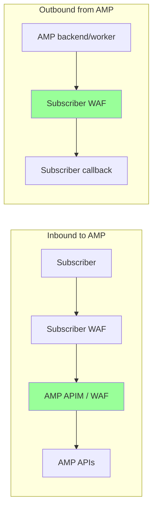

# Subscription & callback flow – sequence diagram and recommendations

This document describes the recommended flow for subscribers (e.g. Victim Path Finder, HMPP) interacting with AMP APIs and for AMP delivering events to subscriber callback URLs.

---

## 1. High-level sequence (recommended)

---

## 2. Inbound only (subscribe) – through APIM/WAF ✅

---

## 3. Outbound (callback delivery) – direct to subscriber ✅

---

## 4. What not to do – outbound via APIM ❌

---

## 5. Recommendations summary

| Flow | Recommendation | Reason |
|------|-----------------|--------|
| **Inbound** (subscriber → AMP) | ✅ **Go through AMP APIM/WAF** | Single entry point; auth (subscription key + JWT), rate limit, and routing in one place. |
| **Outbound** (AMP → subscriber callback) | ✅ **Direct HTTPS to subscriber’s registered callback URL** | One URL per subscriber; no benefit from sending through AMP’s APIM; subscriber’s WAF protects their endpoint. |
| **Callback authenticity** | ✅ **Sign payload (e.g. HMAC) or send short-lived JWT** | Subscriber verifies the request is from AMP using shared secret or AMP’s public key. |
| **Reliability** | ✅ **Queue + delivery worker with retries and DLQ** | Handles subscriber downtime and scales; avoids blocking main API. |
| **Outbound via AMP APIM** | ❌ **Not recommended** | Adds latency and complexity; APIM is for protecting inbound APIs, not for routing many different outbound callbacks. |

---

## 6. Who protects what

- **AMP APIM/WAF:** Protects **inbound** calls to AMP (subscription, courtschedule, etc.).
- **Subscriber WAF:** Protects **their** callback endpoint (rate limit, DDoS, optional allow-list for AMP IPs, then verify signature/JWT).

---

## 7. Outbound design flow – summary and recommendations

**What outbound is:** AMP (subscription service) must send event payloads (e.g. document ID, event data) to each subscriber’s **callback URL** when an event occurs. Subscribers (e.g. HMPP) register that URL and optional shared secret when they subscribe.

**Design flow (recommended):**

1. **Store per subscription:** For each subscription, store callback URL, event types, and (optionally) a shared secret or key for signing. **Where to store: use the database**, not environment variables (see table below).
2. **On event:** When an event occurs, AMP generates a document ID (or similar), looks up which subscriptions match, and for each gets the callback URL and secret from the DB.
3. **Delivery:** AMP (or a dedicated delivery worker) sends an **HTTPS POST** to that subscriber’s callback URL with the payload (document ID, event data) and a signature or short-lived JWT in a header. **Do not** route this request through AMP’s APIM/WAF.
4. **Subscriber side:** The request hits the **subscriber’s WAF** (e.g. hmpp.dev.cjscp.org.uk). Their WAF/backend verifies the signature or JWT, then processes the payload.

**Recommendations for outbound:**

| Recommendation | Why |
|----------------|-----|
| **Direct HTTPS to each subscriber’s registered callback URL** | One URL per subscriber; no single “outbound APIM endpoint”. Scales with number of subscribers. |
| **Do not route outbound through AMP’s APIM/WAF** | APIM is for protecting inbound APIs. Outbound is AMP as client; putting it via APIM adds latency and complexity with no benefit. |
| **Prove authenticity with signature or JWT** | Subscriber verifies the request is from AMP (e.g. HMAC-SHA256 of payload with shared secret, or JWT signed by AMP). |
| **Use a queue + worker for delivery** | Publish “delivery task” to a queue; worker POSTs to callback with retries and DLQ. Handles subscriber downtime and scales. |
| **Let the subscriber’s WAF protect their callback** | Rate limit, DDoS, optional allow-list for AMP egress IPs. AMP only needs outbound HTTPS allowed to subscriber hostnames. |

**Flow in one sentence:** AMP (or worker) looks up the subscription’s callback URL and secret, POSTs the payload with a signature/JWT **directly** to that URL; the subscriber’s WAF protects the endpoint and verifies the request.

**Where to store callback URL, event types, and shared secret (per subscription):**

| Store in | Use for | Per-subscription data? |
|----------|---------|--------------------------|
| **Database** | Callback URL, event types, shared secret **per subscription** | ✅ **Yes.** Each subscriber has different values; they are created/updated when they register or change subscription. The subscription service already has a subscription table/entity – add a column (or table) for callback URL, event types, and secret (store the secret encrypted at rest). |
| **Environment variables** | App-wide config (e.g. `DATASOURCE_URL`, `MATERIAL_CLIENT_URL`) | ❌ **No.** Env vars are fixed at deploy time and shared by all requests. You cannot have one env var per subscriber; they don’t scale and can’t be updated per subscription. |

**Recommendation:** Store **callback URL, event types, and shared secret in the database**, keyed by subscription (e.g. in the same table as subscription id, or a related table). Encrypt the secret at rest. Use env vars only for global config (DB URL, feature flags, etc.), not for per-subscriber data.

---

## 8. Where should the sending mechanism live? (subscription service vs separate delivery service)

| Approach | How it works | Pros | Cons |
|----------|----------------|------|------|
| **Subscription service does sending** | Same app: on event it enqueues a delivery task; a **worker inside the same service** (async consumer or scheduled job) consumes the queue, looks up callback URL + secret from DB, signs, and POSTs to the subscriber. | One deployment, one codebase; secrets stay in one place (DB); simpler ops. | Delivery load (many callbacks, retries) shares CPU/memory with the subscription API; scaling is “all or nothing” unless you scale the whole service. |
| **Separate delivery/signer microservice** | Subscription service only publishes “delivery task” (e.g. subscription id, payload, document id) to a queue. A **separate delivery service** consumes the queue, looks up callback URL + secret from the **same DB** (or receives an encrypted token), signs, and POSTs to the subscriber. | Scale delivery independently (more workers or pods for delivery only); subscription API stays focused on subscribe/unsubscribe and publishing tasks; clear separation of concerns. | Two services to deploy, monitor, and secure; delivery service needs read access to subscription/secret data (DB or message). |

**Recommendation:**

- **Best default:** Use **one service** (subscription service) with **async delivery via a queue**: the API enqueues delivery tasks; a **worker component in the same process** (or same deployable) consumes the queue, signs, and sends. Keeps one deployment and one place for secrets; the queue gives retries and backpressure so the API doesn’t block.
- **Split into a separate delivery microservice** when: (1) delivery volume is high or bursty and you need to scale delivery independently, or (2) you want a hard boundary (e.g. only the delivery service can egress to subscriber URLs). Then the subscription service only publishes tasks; the delivery service reads callback URL and secret from the shared DB (or from an encrypted payload in the message), signs, and POSTs.

**Summary:** Prefer **subscription service + in-process (or same-deployment) queue consumer** for signing and sending. Move to a **separate delivery/signer microservice** when you need independent scaling or a stricter security boundary.

---

*Diagrams use Mermaid. Render in GitHub, VS Code (with Mermaid extension), or [mermaid.live](https://mermaid.live).*
